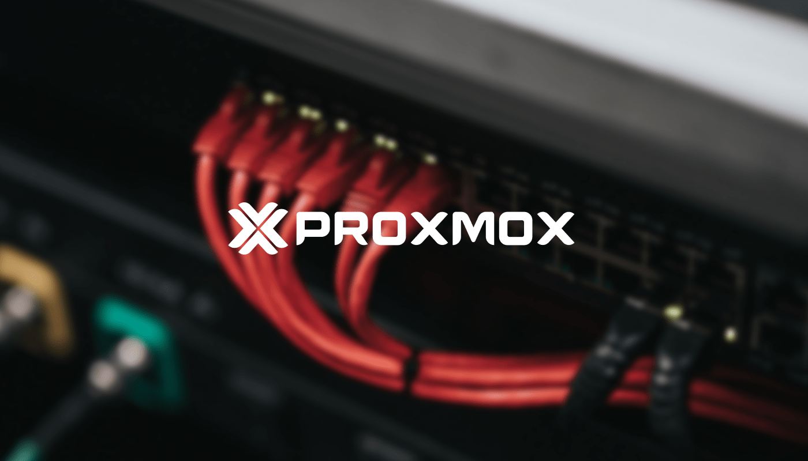
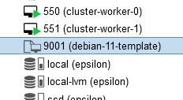

I needed to create a few VMs using [Terraform](https://www.terraform.io/) in Proxmox but having to go through each server and do the first-time setup was annoying, so instead of doing that, I learned how to create cloud-init enabled templates and now I'll share my findings with you.

# What cloud-init means
So according to [cloud-init documentation](https://cloudinit.readthedocs.io/en/latest/) this is what cloud-init does:

> During boot, cloud-init identifies the cloud it is running on and initialises the system accordingly. Cloud instances will automatically be provisioned during first boot with networking, storage, SSH keys, packages and various other system aspects already configured.

Basically, it will take a fresh distribution installation and provision it for you, setting up networking, SSH keys, packages and so on, so you don't have to do it and once the system boots up it is ready for you to use.

# Downloading a cloud image
First step is to download a cloud-native image of the distribution you want, these images come with cloud-init support and are desiged to be run on hypervisors or public clouds such as Azure and AWS that can automatically provision the configuration for your selected distribution.

Here are a couple examples of where to find such images, [Ubuntu cloud images](https://cloud-images.ubuntu.com/) and here are the [Debian cloud images](https://cdimage.debian.org/cdimage/cloud/).

I will use Debian for this example, and I will download a generic cloud x64 compatible image:
```bash
wget https://cdimage.debian.org/cdimage/cloud/bullseye/latest/debian-11-generic-amd64.qcow2
```

# Customize the image
The downloaded image does not include `quemu-guest-agent` which I want to have in order for Proxmox to show details about the VM.

In order to fix this, SSH into the Proxmox node and run:
```bash
apt update
apt install -y libguestfs-tools
virt-customize --install qemu-guest-agent -a debian-11-generic-amd64.qcow2
```
This will install [libguestfs-tools](https://www.libguestfs.org/) and install `quemu-guest-agent` into the image we downloaded earlier. The same process can be used to add other packages into the image.

# Creating the template
We are going to use the terminal instead of the web interface to create the template, so SSH into the Proxmox node for the following commands:
```bash
qm create 9000 --name debian11-template --memory 1024 --net0 virtio,bridge=vmbr0
```
This will create a new VM with ID **9000**, the name **debian11-template**, **1024Mb** of RAM and a network bridge set to **vmbr0** which is the usually the default one created by Proxmox.

```bash
qm importdisk 9000 debian-11-generic-amd64.qcow2 local-lvm
```
Next we import the image we downloaded earlier as a disk for the VM with ID 9000 that we just created. **local-lvm** is the name of the storage in Proxmox where the disk should be stored.

```bash
qm set 9000 --scsihw virtio-scsi-pci --scsi0 local-lvm:vm-9000-disk-0
qm set 9000 --ide2 local-lvm:cloudinit
```
With the first command, we set the disk for the VM to be the disk we just imported in the previous step **vm-9000-disk-0** is the name of the disk that was generated after the import.
The second command creates the cloud-init CD-ROM drive which activates the cloud-init options for the VM.

```bash
qm set 9000 --boot c --bootdisk scsi0
qm set 9000 --serial0 socket --vga serial0
qm set 9000 --ipconfig0 ip=dhcp
```
First we set the boot order and specify the first boot disk to be used to be **scsi0** which is the disk with the cloud image, then we configure a serial console to use as display otherwise we won't see anything in the "Console" view in Proxmox. The last command will set the networking stack config to use DHCP in order for the VM to obtain an IP address.

```bash
qm resize 9000 scsi0 50G
qm template 9000
rm debian-11-generic-amd64.qcow2
```
These are the final steps, resize the disk, otherwise it will be the size of the cloud image we downloaded, in here I make it a 50Gb disk so it has enough storage to install some packages, then we tell Proxmox to make VM 9000 a template and lastly we remove the image we downloaded to free up some space.

# Using the template
This is it, now if you go back to the Proxmox web interface you should see this:

This means that you now have a template.

Right click on it, click on `Clone` and set the `Mode` to `Full Clone` and then fill out the remaining inputs. You will get a new VM created from that template.

To use cloud-init, click on the new VM you made, go to `Cloud-Init` tab and customize your settings and click on **`Regenerate Image`** and that's it!
Start your new cloned VM and after waiting for the boot sequence to finish you should get directly to a login prompt. Enjoy!
