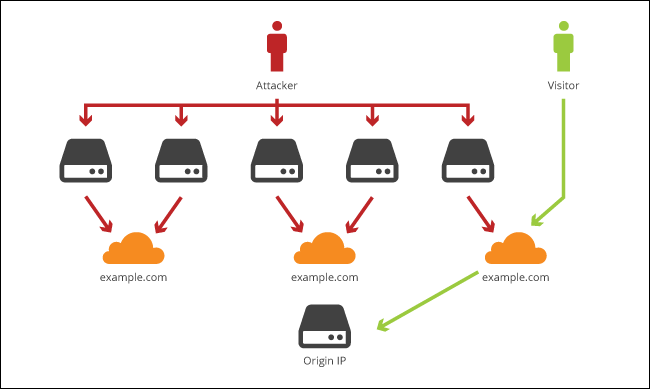
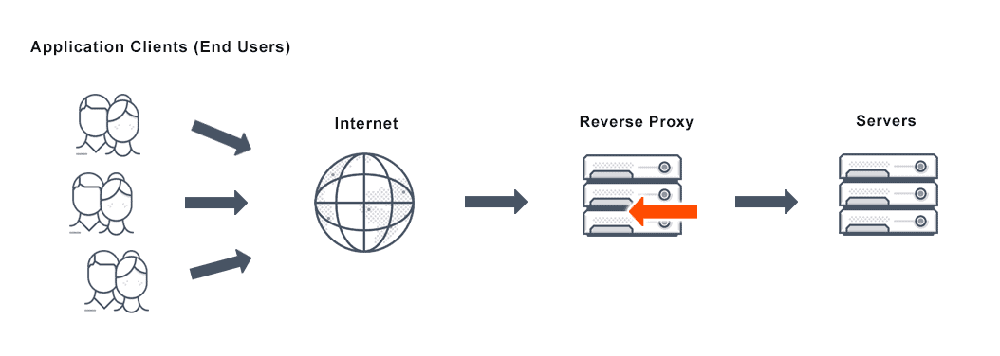

<small>Photo by [jeffloucks](https://unsplash.com/@jeffloucks)</small>

This article will cover a rather small part of what you need to know before going out and buying hardware to build your own lab, but it should be enough to at least know what self-hosting your own stuff is a thing you want to do.

## Motivation
The first thing to get started is to find out if self-hosting is really a thing you want to do, it's not as easy as it sounds and requires **periodic maintenance**. It's easier to get into it if you already work in a field that requires you to work with servers but it's also a great way to start learning about servers and the underlying technologies.

My personal motivation for doing it is to keep practicing my skills at first, now I do it because I really like the ecosystem I've built and I depend on them, having my own personal cloud storage, DNS-level ad blocking, password manager, VPN and private video and music streaming are just a few of the things I can't live without anymore.

So, should you start self-hosting? It depends.

### You should self-host if:
1. You enjoy tinkering with stuff and fussing over minute details, spending many hours or even days on the smallest of problems.
2. You are a generalist who wants to learn anything and everything about computers.
3. You like the cheap thrills you get from being able to achieve everything big companies do with their products at little to no cost.

### You should NOT self-host if:
1. You want convenience and reliability at all times for your services.
2. You hate getting stuck on the smallest problems.
3. You are not concerned about ownership of your data.

## Advantages of self-hosting
Self-hosting your own services has a wide range of benefits. It's a great way to gain a deeper understanding of tech and how the internet works under the hood. You decide what to do with your data, where it's stored and who has access to it (mostly).

### Some examples
- Save costs by switching from Dropbox/Google Drive to your own solution powered by [Nextcloud](https://nextcloud.com/). You can use it just for file sharing or as a platform for productivity, it can sync your calendars, contacts and documents, tell you the weather, fetch the latest news from any site you want via RSS and many more.
- Have your own private media streaming server with things like [Jellyfin](https://jellyfin.org/) or [Plex](https://www.plex.tv/) where you can have your movies/tv shows/music/family photos & videos, all ready to be viewed from anywhere.
- Have all ads blocked on your network with the help of [Pi-Hole](https://pi-hole.net/) or [AdGuard Home](https://adguard.com/en/adguard-home/overview.html). It will block nearly all ads on all of your connected devices automatically, this helps increase your privacy and makes pages load faster in most cases.

## The underlying cost
The cost for all of this is the electricity bill and your time, at least at first. You can start out with any hardware you already have, that's why I did not factor it but once you start going deeper there will be hardware costs, HDDs/SSDs, network switches, cables, more RAM, etc. But there are good deals on older hardware, especially refurbished enterprise servers, as long as electricity is not an issue.

## The hardware
You'll need hardware, it can be an old computer that you no longer use, your current computer (If you just want things running for as long as it's powered on or just to try things out) or just go with a [Raspberry Pi](https://www.raspberrypi.org/), it's a pretty small investment, very low power and It's really useful to have in general for any tinkerers.

## Terminology and best practices
This next part will cover some of the terms and practices that you should become familiar with over time, maybe you already know some of this stuff or you're a complete beginner, I doesn't matter.

### Hide your server IP, seriously
Let's say you want to host a website on your server that you host in your home, this has some serious privacy and security implications, you definitely don't want to get hit with a [DDoS](https://en.wikipedia.org/wiki/Denial-of-service_attack) attack or have your location known by everyone.

Use an edge CDN to put a barier in front of your server, one such service is [Cloudflare](https://cloudflare.com)



In short your domain points to Cloudflare's servers and those servers redirect the filtered traffic to your server (only a few ports, usually just 80 and 443 for HTTP/HTTPS)

**Of course, this only applies if you want to use a domain and want to expose some of your services on the internet.**

### Secure SSH
If you already have experience with linux server administration you already know where I'm going with this one, protect your SSH access.
- Only use SSH keys, disable password authentication and even direct root access
- Use [fail2ban](https://linuxize.com/post/install-configure-fail2ban-on-ubuntu-20-04/)
- It is recommended that the user that you use to SSH into your server should not have passwordless `sudo` access, just as a last resort
- Is you plan to monitor your server, absolutely monitor your SSH access logs for successful entries

Here are some basic `sshd_config` configurations I find essential on any server:
```
PasswordAuthentication no
PermitRootLogin no
PermitEmptyPasswords no
GSSAPIAuthentication no
PubkeyAuthentication yes
```
Just put these at the end of the file in `/etc/ssh/sshd_config`, restart the SSH service and you're good to go. **Just make sure you've added your SSH key beforehand. ([Tutorial on how to do that](https://www.digitalocean.com/community/tutorials/how-to-set-up-ssh-keys-2))**

### Dealing with dynamic IP
If your IP address changes periodically or whenever you reboot your router that means you have a dynamic IP address. This will cause you trouble if you want to have a domain, let's say `mydomain.net` be served from your server hosed at home.

There are a lot of services to help you deal with this one, such as [DuckDNS](https://www.duckdns.org/), [No-IP](https://www.noip.com/), [Dynu](https://www.dynu.com/) and so on.
My favorite currently is [ddclient](https://github.com/ddclient/ddclient), it's a simple program that will fetch your public IP address periodically and will update your DNS if it has changed since last time, works really well with Cloudflare but supports a ton of services.

### Reverse proxy
I see lots of people struggling with this one so I'm going to try to clear things out.

What is a reverse proxy?


> A proxy server is a go‑between or intermediary server that forwards requests for content from multiple clients to different servers across the Internet.

Let's take a look at a real example, suppose you have two applications (Nextcloud and Jellyfin), you host them on the same server and you want to access both of them.
- Your domain is `myhome.net`
- Nextcloud runs on port 80 so if you open `http://myhome.net` in a browser it opens up just fine
- Jellyfin runs on port 9600 so if you want to access it you'd have to point your browser to `http://myhome.net:9600`

This is not optimal, you want something easier to remember, such as `nextcloud.myhome.net` and `jellyfin.myhome.net`, let's take a look at how to do that.

I'll use [Nginx](https://www.nginx.com/) as my reverse proxy, first step is installing it, if you're on Ubuntu you can simply do `sudo apt install nginx`. Assuming your applications are stopped, if you open your browser to `http://myhome.net` you should see the default nginx page.

**!! DISCLAIMER !!**
This is just for demonstration purposes and assumes you already have your DNS correctly configured. The nginx configurations bellow might not work for you and are not an example of best practice, it's up to you to properly write your configuration for your needs.

Now, to setup a reverse proxy for Nextcloud:

First thing for this to work is to **change the port Nextcloud is using** to something other than 80 since nginx will be handling that from now on. I won't go into that as it's out of scope and documented on the official documentation already.

Assume that Nextcloud now runs on port `8080`

Next, go to `/etc/nginx/sites-available` and create a new file `nextcloud.conf` with the following contents:
```properties
server {
        listen 80;
        server_name nextcloud.myhome.net;

        location / {
                proxy_pass http://127.0.0.1:8080;
        }
}
```
This simply tells nginx to pass all traffic coming from `nextcloud.myhome.net` on port `80` onto another program, in this case whatever is on port `8080`, in our case that's Nextcloud.
Save the file, restart nginx and open your browser to `http://nextcloud.myhome.net` and you should see Nextcloud.

Do the same for your other services (In this case Jellyfin) and you're good to go. Hopefully this clears things out on what is a reverse proxy and what does it do.

### Backups, for the love of god, always have backups
If you plan on using your server for storing important data, **ALWAYS** have backups, it will save your skin in the long run (saved mine multiple times already).

To get some things out of the way first, **RAID is not a backup**, doesn't matter if you have a RAID mirror and think you're always careful with your data, mistakes happen and that's when real backups come in handy.
Some reasons for why RAID should never be treated as a backup:
- File corruption
- Human error (deleting files by mistake)
- Catastrophic damage (someone dumps water onto the server)
- Viruses and malware
- Software bugs that wipe out data
- Hardware problems that wipe out data or cause hardware damage (controller malfunctions, firmware bugs, voltage spikes, etc)

Plan your backups according to the [3-2-1 rule](https://www.nakivo.com/blog/3-2-1-backup-rule-efficient-data-protection-strategy/) and have a good strategy for it.

- Make sure the storage provider where you plan to store your backups is trusted, has really good uptime and fast support. Providers such as [AWS](https://aws.amazon.com/) or [rsync.net](https://www.rsync.net/) are good for these sorts of things.
- Experiment until you find the best tool for the job, simply using `rsync` or `scp` on a schedule might work for some, other tools such as [borgbackup](https://borgbackup.readthedocs.io/en/stable/) or [Duplicati](https://www.duplicati.com/) might work for others.
- Monitor your backups, make sure the backups run on time and without errors, make use of services like [Healthchecks](https://healthchecks.io/) and have alerts be sent your way whenever a backup is late or had any errors.

I'll go into details about my own backup strategy in a future post.

### Learn to love containers
You know what's the best way to keep your server bloat-free? That's right, **containers**.
I'm talking about [Docker](https://www.docker.com/) containers specifically. I won't go into low-level details on how docker works or things like [Kubernetes](https://kubernetes.io/) since I still want to finish this article by the end of the year, but to put it simply:

Imagine you have an application you really want to run but it needs a lot of dependencies and those dependencies need to be configured for that specific application, and maybe some of those same dependencies are needed for another application you already have but need a different configuration, it's going to be a nightmare managing all of this.
But now imagine that this application can be put in a box with all of it's dependencies and configurations already made for it to work, you just put that box on your server along other similar boxes and none of them interfere with each-other unless you them to. That's basically docker, let's take a look at an example:

```bash
docker run -d \
  --name=nextcloud \
  -e PUID=1000 \
  -e PGID=1000 \
  -e TZ=Europe/London \
  -p 8080:80 \
  -v /opt/nextcloud/config:/config \
  -v /opt/nextcloud/data:/data \
  --restart unless-stopped \
  lscr.io/linuxserver/nextcloud
```
This would just pull Nextcloud and run it on port `8080`, that's it. Now Nextcloud is running under the user and group with the id `1000`, the timezone is set to London and all the configuration and data is saved to `/opt/nextcloud`, it's that easy.

And if you don't want to remember all this string of arguments, just use a `docker-compose.yml` file with these contents:
```yaml
---
version: "2.1"
services:
  nextcloud:
    image: lscr.io/linuxserver/nextcloud
    container_name: nextcloud
    environment:
      - PUID=1000
      - PGID=1000
      - TZ=Europe/London
    volumes:
      - /opt/nextcloud/config:/config
      - /opt/nextcloud/data:/data
    ports:
      - 8080:80
    restart: unless-stopped
```
And run `docker-compose up -d`, it does exactly what it did before but now you have all of it in a single file that you can manage more easily.

So give containers a try and see for yourself how much time and headache not having to worry about manually managing dependencies and configurations for applications can save you.

### Automate everything you can
Say you have only one server now, you spend 30-60 minutes just to go from a fresh install of Ubuntu to the state that you like, installing packages, configuring SSH settings, firewall, maybe adding your dotfiles so you can have a fancy `vim` for faster file edits.

Now what happens if your boot disk just dies one day and you have to redeploy it or you get a couple of Raspberry Pi's that you want to have the same config as your other server, you have to spend all that time again right? **Wrong!**

There are tools made for this, to help you automate nearly **anything**, from setting up the firewall or your dotfiles to deploying your entire infrastructure on entirely fresh servers.
Take a look at [Ansible](https://www.ansible.com/), [Puppet](https://puppet.com/) or [Chef](https://www.chef.io/) and see what each of them does it.

I personally use Ansible to automate nearly the entirety of my infrastructure deployment (and it's publicly available [here](https://github.com/GeorgeGedox/infrastructure)), I cannot count the number of hours this has saved me.
I had to do a full redeployment 3 times so far, the first time I did it manually because I did not have anything written in Ansible yet and it took me around 2 days to have it back to the state I had before, the next 2 deployments took around 15 minutes, that's the time it took for Ansible to finish the deployment, I did other stuff while waiting for it to finish.

### Focus on security
I want to end article on this topic because I think this is the part many fear the most, exposing your server on the internet and having it hacked or worse.

I'm not an expert on security but I like to think that I know what I'm talking about when I say to **focus on security** no matter if your server is facing the internet or only available in your LAN.
- Learn a bit about networking, how your home network is laid out, what is port forwarding, what happens if you access your IP address from outside your home network
- **Set up a firewall**, either software level like `iptables`, `ufw` or `firewall-cmd`, or dedicated hardware firewall. Learn it's rules and how to allow or block specific traffic into the network.
- Monitor your logs and metrics, that's how you know if something happened on your server without your permission, setting up tools like [Graylog](https://www.graylog.org/), [Loki](https://grafana.com/oss/loki/), [Grafana](https://grafana.com/) and [Prometheus](https://prometheus.io/) become essential once you know what to look for.
- Keep your system and applications up to date and check the change log beforehand to know if there are breaking changes between versions.
- **DO NOT** have SSH access from the internet allowed unless you really know what you are doing
- Don't expose ports that are not needed, allow only ports you use outside the server like 80 and 443 unless it's essential
