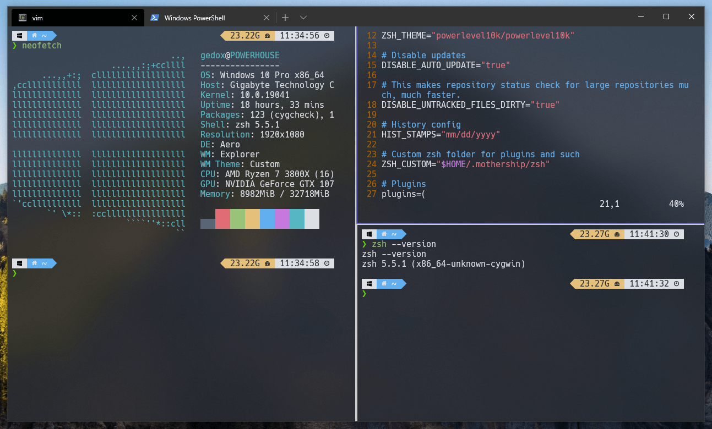
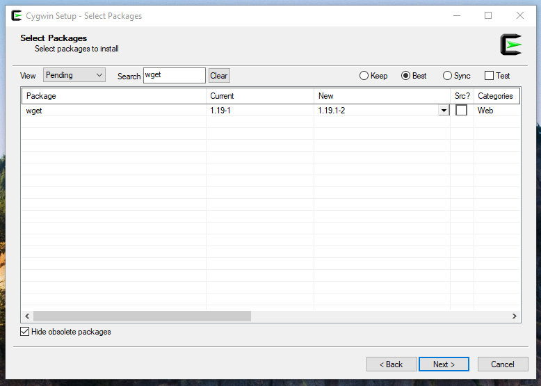

<div class="alert alert-info">
  <h3>Parts of this article are now outdated</h3>
  <p>With updates, some of the things written below do not reflect the reality today, WSL2 is now pretty good, Windows Terminal even got a quake mode, and I moved my workflow to docker.</p>
</div>

Working with lots of servers I became quite attached to working with a shell, but I'm stuck using Windows because of the Adobe suite, the Stream Deck I use for macros, and other proprietary software that I don't have an alternative for.

I decided to try out [WSL](https://docs.microsoft.com/en-us/windows/wsl/about) to fill my needs, it worked fine for a bit, having integration with Docker in WSL2 was a big step up from WSL1 but the limitations started to show up sooner than I expected.
WSL2 is great for giving you a taste of Linux on Windows, but the following problems made me go back to the drawing board:
- Docker volume mounts inside the WSL machine fails as Docker for Windows doesn't know the path to the WSL filesystem
- I depend a lot on Vagrant for web development and Hyper-V and VirtualBox don't play nice, leading to VMs not booting properly or randomly triggering a kernel panic
- Running background services inside WSL such as nginx or mysql is not yet supported
- Running full desktop environments for tools that offer only a GUI is very unstable

So I decided to try something else in order to keep my ability to run VMs with Vagrant without sacrificing much of the Linux experience I got on WSL.

# The end goal



What I wanted to achieve with this setup:
`
- ✅ No Hyper-V or WSL needed so it doesn't intervene with Vagrant and VirtualBox
- ✅ Has the ability to install and run a large amount of tools (ansible, node, wget, python, curl, etc)
- ✅ Is highly customizable both in terms of appearance and functionality (tabs, window splitting, shortcuts, plugins, etc)
- ✅ Is integrated with Windows and can call Windows programs directly
- ✅ Can be opened in the current working directory via context menu
- ✅ Is easy to back up and transfer between Windows installs

# Windows terminal
It's a fancy terminal emulator built by Microsoft, it's open-source under the MIT license. I'm quite happy with it, has support for tabs, unicode characters, theming and styling, window splitting and probably more things, but I didn't bother to go much deeper yet. [GitHub Repository](https://github.com/microsoft/terminal)

Installing Windows Terminal is as easy as opening the Windows Store, searching for `Windows Terminal` and installing it. You can also get the source from GitHub and compile it yourself, or use a package manager like winget or Chocolatey.

### Customization
Once you have Windows Terminal installed, open it and play around for a bit, you should find the "Settings" panel or you can hit `CTRL+,` to open it. A JSON file should open in your editor of choice automatically.

I suggest visiting the Microsoft documentation [here](https://docs.microsoft.com/en-us/windows/terminal/customize-settings/global-settings) about the various properties this file has to offer in order to fully understand how to take advantage of all the features.

I plan on uploading all my dotfiles regarding this setup on GitHub but for now this is how I customized my terminal:
The font I'm using is called "Hack Nerd Font" and can be downloaded at [Nerd Fonts](https://www.nerdfonts.com/).
```json
...
// The default style defined in profiles.defaults
// is used by all profiles of the terminal
"profiles":
    {
        "defaults":
        {
            "colorScheme": "One Half Dark",
            "closeOnExit": "always",
            "cursorColor": "#9dd66f",
            "cursorShape": "vintage",
            "fontFace": "Hack NF",
            "fontSize": 11,
            "useAcrylic": true,
            "acrylicOpacity": 0.8,
            "snapOnInput" : true
        },
        "list": [ ... ]
        ...
    }
...
```

# Cygwin, GNU for Windows
Go to the [Gygwin website](https://www.cygwin.com/), download it and do a fresh install, it's pretty straight forward, on the package list screen make sure `wget` is marked for install, we'll need it on the next step.



### Package management for Cygwin
Let's say we want to install `ansible`, `git` and `vim`, currently we'd have to run the installer again and go trough the whole process again until we get to the packages selection screen where we have to search trough all of the versions ... do you see the problem?

I come from linux distributions such as CentOS and Ubuntu where all of this can be done with a simple `sudo apt install -y ansible git vim` and be done with it.

Fear not, [apt-cyg](https://github.com/transcode-open/apt-cyg) comes to rescue. What is `apt-cyg`? It's a package manager for Cygwin, here's how to install it in two simple commands:

```bash
wget rawgit.com/transcode-open/apt-cyg/master/apt-cyg
install apt-cyg /bin
```

That's all, now you can simply do `apt-cyg install <package name>` to install a package, go to the package's [GitHub Repository](https://github.com/transcode-open/apt-cyg) to see all the commands or run `apt-cyg help`.

# Integrating Cygwin with Windows Terminal
Now we want to be able to open the Windows Terminal and have one of the shells installed trough Cygwin open automatically and be usable, also we want to have a context menu entry in Windows to launch our shell in the current directory.

### Windows Terminal configuration
Open your settings file by opening the Windows Terminal and pressing `CTRL+,` and look for the list of profiles, create a new one, it should look like this:

```json
{
	"guid": "{cdaa0fd5-e104-4561-9b7c-23177717bc48}",
	"hidden": false,
	"name": "Gygwin",
	"commandline": "\"%HOMEDRIVE%\\cygwin64\\bin\\zsh.exe\" -l -c \"cd $OLDPWD; exec /bin/zsh\"",
	"icon" : "%HOMEDRIVE%\\cygwin64\\Cygwin-Terminal.ico",
	"startingDirectory" : "%HOMEDRIVE%/cygwin64/home/%USERNAME%"
}
```

The `guid` has to be unique in the list of profiles, it's used to identify the profile and also used to set the default profile to open when you launch the terminal.

The `commandline` is where all the magic happens, `%HOMEDRIVE%` is a Windows environment variable, it's set to the drive letter of the current windows install location, in my case that's `C` because that's where I've installed Cygwin, you can just specify the drive letter instead. And don't worry about `zsh` you can replace that with `bash` if you'd like, I just like `zsh` better.

The command goes something like this:
Launch `C:\cygwin64\bin\zsh.exe` and execute this command `cd $OLDPWD; exec /bin/zsh` as a logged shell, this will change directory to `$OLDPWD` which is an environment variable set by windows terminal with the directory it's been opened in, and then execute the `zsh` shell in that directory. I know it's a bit hard to understand but it's needed for the context menu integration to work properly.

The `startingDirectory` just changes our terminal to open in our user's directory inside of Cygwin's install directory, by default the Windows Terminal doesn't know how to handle Cygwin's virtual filesystem and defaults to `System32` which is not really a place you want to be most of the time.

### Context menu integration
What that means? Open a directory in Windows and right click inside that directory, you see that menu? That's the context menu. We want to have an entry there that allows us to launch the Windows Terminal in that directory.

To do this start by creating a `cygwin-integration.reg` file somewhere and open it with a text editor.
Next, grab this code and paste it in there, but make sure to **READ IT**, don't go around executing code that you don't trust or don't know what it does, so read it and try to understand what it does.

This one will create 3 new registry entries in the context menus for a directory, a directory's background, and a drive.

Also one more thing, **MODIFY** the `<user>` with your Windows user folder name and please go to the path listed in these commands and make sure `wt.exe` exists at that path, otherwise your menu entry won't work.
```
Windows Registry Editor Version 5.00

[HKEY_CLASSES_ROOT\Directory\shell\wt]
@="Open Windows Terminal here"
[HKEY_CLASSES_ROOT\Directory\shell\wt\command]
@="C:\\Users\\<user>\\AppData\\Local\\Microsoft\\WindowsApps\\wt.exe -d \"%V.\""

[HKEY_CLASSES_ROOT\Directory\Background\shell\wt]
@="Open Windows Terminal here"
[HKEY_CLASSES_ROOT\Directory\Background\shell\wt\command]
@="C:\\Users\\<user>\\AppData\\Local\\Microsoft\\WindowsApps\\wt.exe -d \"%V.\""

[HKEY_CLASSES_ROOT\Drive\shell\wt]
@="Open Windows Terminal here"
[HKEY_CLASSES_ROOT\Drive\shell\wt\command]
@="C:\\Users\\<user>\\AppData\\Local\\Microsoft\\WindowsApps\\wt.exe -d \"%V.\""
```

Now save the file and double click on it to install the entries in your registry. Now you can test your new menu entry by opening a directory or even right clicking on your desktop and clicking on the `Open Windows Terminal here` entry, it should do what it says.

If you somehow mess it up just open the file again, update it and execute it again.

If you're happy with what you have so far and prefer Bash over ZSH then you can skip the rest of the article, it goes into ZSH, customization, plugins and powerline.

# ZSH
From now on I'll assume that you're somewhat familiar with what ZSH is and how to configure it on a basic level so I won't go over the basics.

### Installing on Cygwin
It's as simple as running `apt-cyg install zsh`, you'll see a `zsh.exe` in your `/bin` directory and typing `zsh` should launch you directly into your new shell. Don't get too attached to it because we're going to change it a bit.

### Oh My Zsh
What's this? It's essentially a framework to manage your ZSH shell, it allows you to add plugins, modularize your shell config and some really advanced theming.

You can grab it from their [GitHub Repository](https://github.com/ohmyzsh/ohmyzsh), install it and run trough the setup. **Follow the readme on the page**, it does a much better job at explaining what to do than I will ever do, or ever have the energy to do it.

### Powerlevel10k
This the last stop, one of the fancies and most complex themes for ZSH so if you're perfectly happy with your setup you can safely skip it.

But if you really want to give it a try and get lost for a few hours customizing every little detail of your shell, go to their [GitHub Repository](https://github.com/romkatv/powerlevel10k) and follow the steps for **Oh My Zsh**.

I'll let you set up the theme because everyone's taste is different and having your own personal touch in the terminal is part of the pleasure.

For fonts you can use [Nerd Fonts](https://www.nerdfonts.com/) and remember that to change your font, you have to edit the Windows Terminal configuration.

# Extra
I don't know if you've already found out but you can call windows programs directly from the terminal, for example cd into a directory and run `explorer.exe .`, it'll open the directory in the Windows file manager.

Neat, right? That's why I set an alias for that like so:

```
# Open current dir in explorer
alias explore="explorer.exe ."
```

Now when I type `explore` it'll open the current directory in explorer. Play around and build your own aliases to ease your workflow.
